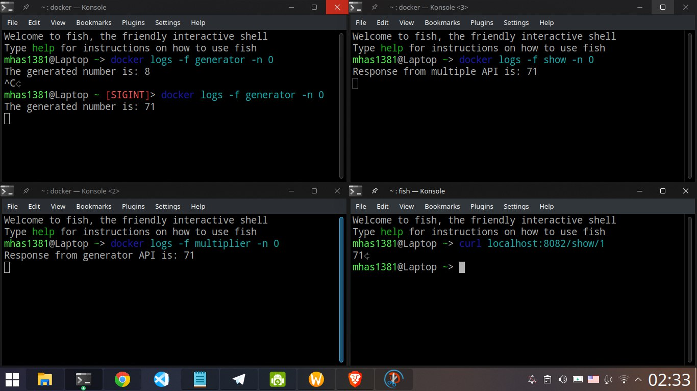

  <h1 align="center">
    Number Micro System
  </h1>
  <p align="center">genetate,multiple and show number</p>
<p>This micro system contains 3 spring boot project 
first project (generator) generates random number and give out API
then multipier project get the api and multiple that and give out API to show project that prints the final result
those projects work in the same network</p>

## Download & Setup Instructions :
first make sure you have docker installed on your system
Clone the project. This will download the GitHub respository files onto your local machine.
```Shell
git clone https://github.com/mhas1381/Internship-Assignments.git
```
```shell
cd projects/number micro system-maven
```
```shell
docker-compose -d --build
```
for generating number:
```shell
curl http://127.0.0.1:8080/generate
```
for multipy that :
```shell
curl http://127.0.0.1:8081/multiple/{number}
```
for final result:
```shell
curl http://127.0.0.1:8082/show/{number}
```
